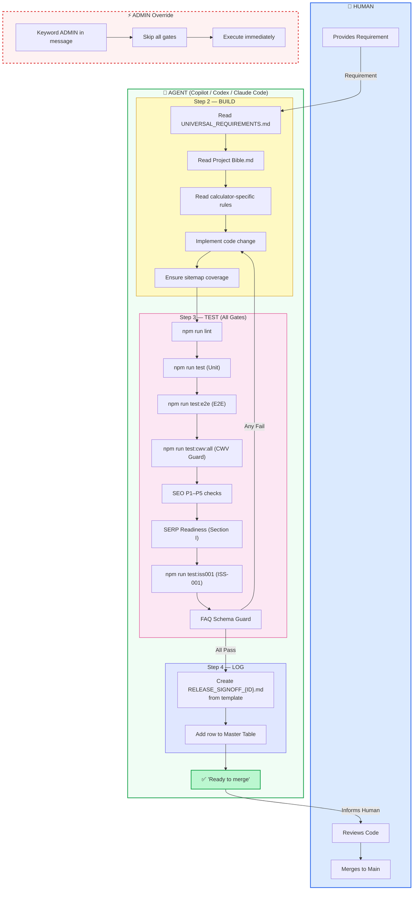
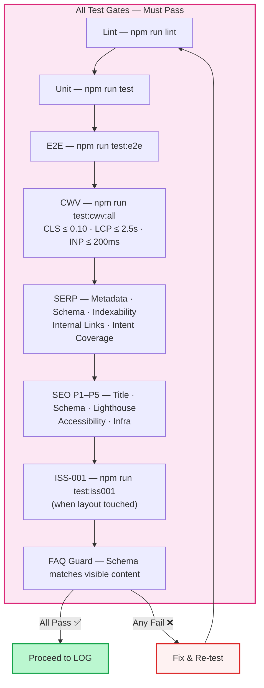
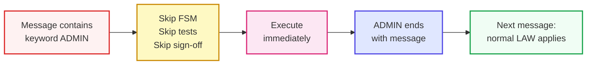

# CalcHowMuch — Agent Workflow Diagram

> Factory Pipeline: **Requirement → Build → Test → Log → Ready to Merge**

---

## Full Pipeline

---

## Document Chain

```mermaid
flowchart LR
    UR["UNIVERSAL_REQUIREMENTS.md\n(Highest authority)"]
    PB["Project Bible.md\n(Strategy & design)"]
    RC["RELEASE_CHECKLIST.md\n(Pass/fail gates)"]
    RS["RELEASE_SIGNOFF.md\n(Template)"]
    RSF["release-signoffs/\nRELEASE_SIGNOFF_{ID}.md\n(Per-release evidence)"]
    MT["Release Sign-Off\nMaster Table.md\n(Historical record)"]

    UR --> PB --> RC --> RS --> RSF --> MT

    style UR fill:#fef2f2,stroke:#dc2626,stroke-width:2px
    style PB fill:#fef9c3,stroke:#ca8a04,stroke-width:2px
    style RC fill:#fce7f3,stroke:#db2777,stroke-width:2px
    style RS fill:#e0e7ff,stroke:#4f46e5,stroke-width:2px
    style RSF fill:#dbeafe,stroke:#2563eb,stroke-width:2px
    style MT fill:#f0fdf4,stroke:#16a34a,stroke-width:2px
```

---

## Roles at a Glance

```mermaid
flowchart LR
    subgraph HUMAN_ROLE["🧑 HUMAN"]
        direction TB
        HR1["Provides requirements"]
        HR2["Reviews code"]
        HR3["Merges to main"]
        HR4["Has final release authority"]
    end

    subgraph AGENT_ROLE["🤖 AGENT"]
        direction TB
        AR1["Builds the requirement"]
        AR2["Runs ALL tests"]
        AR3["Fills release sign-off"]
        AR4["Says 'Ready to merge'"]
        AR5["Does NOT merge"]
    end

    HUMAN_ROLE ---|"Requirement"| AGENT_ROLE
    AGENT_ROLE ---|"Ready to merge"| HUMAN_ROLE

    style HUMAN_ROLE fill:#dbeafe,stroke:#2563eb,stroke-width:2px
    style AGENT_ROLE fill:#f0fdf4,stroke:#16a34a,stroke-width:2px
```

---

## Test Gate Matrix

---

## ADMIN Override Flow

---

> **One-Line Intent:** Requirement comes in. Agent builds, tests, and logs. Human merges. ADMIN overrides everything.
